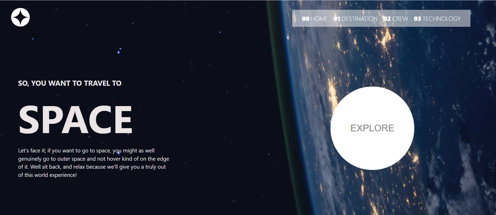
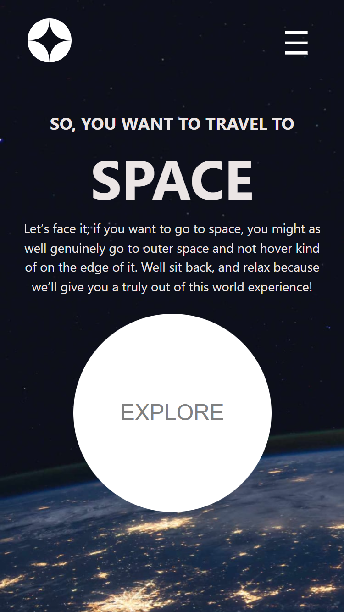

# 🚀 Space Tourism Website

**Live Site:** [space-tourism-website-okedo01.netlify.app](https://space-tourism-website-okedo01.netlify.app/)

A visually immersive and fully responsive space tourism website inspired by a frontend challenge. Built with modern web technologies to deliver a clean UI, smooth navigation, and a mobile-first experience.

---

## ✅ Users Should Be Able To:

- Navigate between pages (Home, Destination, Crew, Technology)
- View different destinations and crew members dynamically
- Interact with tabbed interfaces and responsive menus
- Enjoy a seamless experience on mobile, tablet, and desktop
- Explore space content with a clean and accessible layout

---

## ✨ Features

- 🌌 Multi-page layout with themed backgrounds
- 📱 Fully responsive design for all screen sizes
- 🔁 Animated tab transitions and navigation
- 💡 Semantic HTML & accessibility considerations
- 🎨 Custom layout and typography using Tailwind CSS

---

## 🛠️ Tech Stack

- **React** – Component-based UI
- **TypeScript** – Type-safe logic and props
- **Vite** – Lightning-fast development
- **Tailwind CSS** – Utility-first styling
- **React Router** – Navigation without reloads

---

## 📷 Screenshots

### 💻 Desktop View

### 📱 Mobile View

